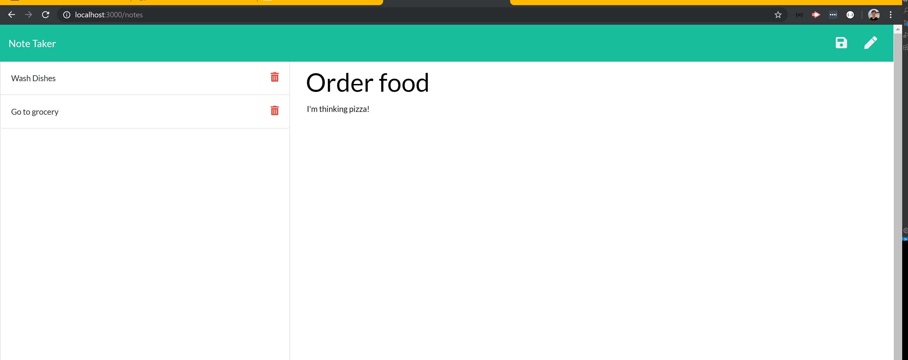

# note-taker-express 

## Table of Contents
1. [ Description ](#description)
2. [ Installation ](#installation)
3. [ Screenshot ](#screenshot)
4. [ Questions ](#questions)

## Description
This application allows users to create, save, and delete notes. It uses an Express backend to read and 
write to a JSON file that acts as a database. The folder structure and code from the second commit was provided
by an instructor as the purpose of this project was to become more familiar with routing funcionality. Files
added by me specifically include: 
* [server.js](server.js)
* [routes/api.js](/routes/api.js)
* [routes/html.js](/routes/html.js)

## Installation
Users should run 'npm install' to require dependencies. Requirements for this application not included in native JavaScript include: 
* [uniqid](https://www.npmjs.com/package/uniqid)
* [express](https://www.npmjs.com/package/express)

## Screenshot

# Questions
For any questions, please contact [tkennedy118](http://github.com/tkennedy118) at tkennedy118@gmail.com.